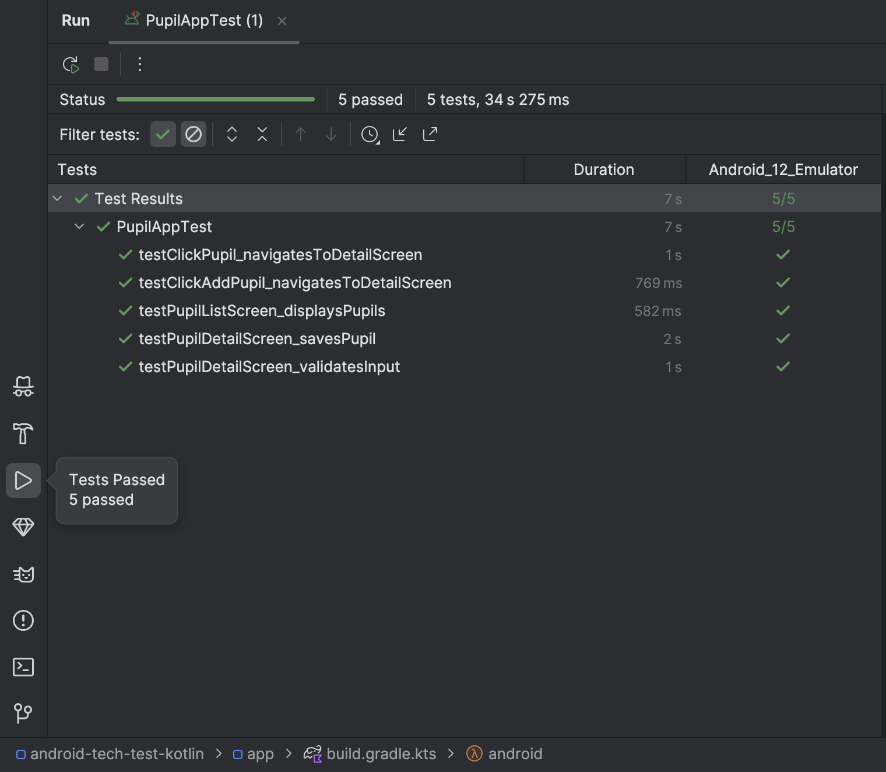

# Pupil Management App
## 📌 Overview

This project is a Pupil Management System built with Jetpack Compose, Room Database, Paging 3, and WorkManager. It provides functionalities to list, add, update, and synchronize pupil data with a remote API. The app is designed to work both online and offline, ensuring smooth data persistence and background sync.

## 🛠️ Architecture & Design

The app follows the MVVM (Model-View-ViewModel) architecture and uses Android Jetpack libraries for efficient state management and data persistence.

## 🏗 Key Components
### UI Layer (Jetpack Compose): 
Displays a paginated list of pupils using LazyColumn and allows users to add or edit pupil details with form validation.

### Data Layer (Room Database + Repository Pattern): 
Manages local storage using Room and handles data fetching and caching using Paging 3.

### Synchronization & Background Tasks:
Uses WorkManager to sync offline-added pupils when online and fetches paginated data from the API while keeping Room database up to date.

## Assumptions Made
- Pupils have unique IDs assigned by the backend, so local IDs may need to be updated after a sync.
- Network failures are handled with retries, ensuring no data loss.
- Pupils updates and additions are stored and marked as synced after successful upload.
- The UI remembers edited data across rotations

## Tests 🧪
- UI tests to ensure apps functionality and stability

## Potential Enhancements
- Better Error Handling – Improve user feedback for network errors.
- Better sync management - Track failed syncs due to FE error and be able to remove them.
- Add more tests - Add more tests than the current tests available.
